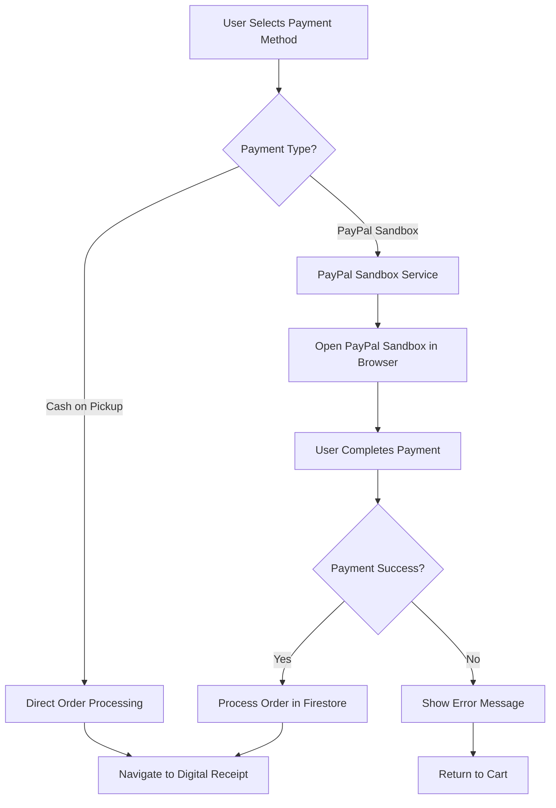

# PayPal Sandbox Integration Setup Guide

This guide explains how to set up and test PayPal Sandbox integration for payment methods in your VeggieConnect Flutter application.

## Overview

The PayPal Sandbox integration provides a testing environment for payments without using real money. This allows you to:

- Test payment flows safely
- Simulate successful and failed transactions
- Develop and debug payment features
- Prepare for real API integrations

## Features Implemented

### ✅ **PayPal Sandbox Service**
- Complete PayPal Sandbox integration
- Browser-based payment processing
- Success/cancel handling
- Order processing after payment
- Error handling and user feedback

### ✅ **Updated Payment Methods**
- "PayPal Sandbox" → Uses PayPal Sandbox for testing
- Cash on Pickup → Direct order processing

### ✅ **Test Account Management**
- Pre-configured test accounts
- Demo balances for testing
- Easy credential copying
- Step-by-step testing instructions

## PayPal Sandbox Test Accounts

### Buyer Account
- **Email**: `buyer@paypalsandbox.com`
- **Password**: `PayPal123!`
- **Balance**: Unlimited demo balance

### Seller Account
- **Email**: `seller@paypalsandbox.com`
- **Password**: `PayPal123!`
- **Balance**: Unlimited demo balance

## How to Test Payments

### Step 1: Add Items to Cart
1. Browse products in your VeggieConnect app
2. Add items to your cart
3. Go to the cart page

### Step 2: Select Payment Method
1. Click "Checkout" button
2. Select either:
   - **"PayPal Sandbox"** (For testing payments)
   - **"Cash on Pickup"** (Pay when collecting order)

### Step 3: Complete Payment
1. PayPal Sandbox checkout page opens in your browser
2. Use the buyer account credentials:
   - Email: `buyer@paypalsandbox.com`
   - Password: `PayPal123!`
3. Complete the payment using demo balance
4. Return to the app

### Step 4: Confirm Payment
1. In the app, click "Payment Complete"
2. Order will be processed and marked as paid
3. You'll be redirected to the digital receipt

## Code Structure

### Key Files Created/Modified:

1. **`lib/services/paypal_sandbox_service.dart`**
   - Main PayPal Sandbox service
   - Payment processing logic
   - Order management after payment

2. **`lib/widgets/payment_method_selector.dart`**
   - Updated to show PayPal Sandbox options
   - Clear labeling for test environment

3. **`lib/customer-side/payment_processing_page.dart`**
   - Integrated PayPal Sandbox processing
   - Handles success/cancel scenarios

4. **`lib/customer-side/paypal_test_accounts_page.dart`**
   - Test account information page
   - Instructions for testing
   - Credential copying functionality

5. **`lib/customer-side/cart_page.dart`**
   - Added PayPal test accounts button
   - Updated payment flow integration

## Payment Flow



## Configuration

### PayPal Sandbox URL
The current implementation uses a sample PayPal Sandbox URL:
```dart
static const String _sampleCheckoutUrl = 
    'https://www.sandbox.paypal.com/checkoutnow?token=EC-60U79048BN7719609';
```

### Customizing the Integration

To use your own PayPal Sandbox setup:

1. **Create PayPal Developer Account**:
   - Go to [developer.paypal.com](https://developer.paypal.com)
   - Create a developer account
   - Create a new application

2. **Get Sandbox Credentials**:
   - Copy your sandbox client ID
   - Update the checkout URL generation

3. **Update the Service**:
   ```dart
   // In paypal_sandbox_service.dart
   static String generateCheckoutUrl({...}) {
     // Replace with your PayPal API call
     return 'https://www.sandbox.paypal.com/checkoutnow?token=YOUR_TOKEN';
   }
   ```

## Error Handling

The integration includes comprehensive error handling:

- **Network Errors**: Retry mechanism with user feedback
- **Payment Cancellation**: Graceful handling with return to cart
- **Browser Launch Failures**: Clear error messages
- **Order Processing Errors**: Database transaction safety

## Security Considerations

- **No Real Money**: All transactions use demo balances
- **Sandbox Environment**: Isolated testing environment
- **Secure Communication**: HTTPS for all PayPal communications
- **Data Validation**: Proper input validation and sanitization

## Future Integration

The code is designed to be flexible for future real API integrations:

### For Real GCash Integration:
```dart
// Replace PayPal Sandbox with real GCash API
if (widget.paymentMethod == 'gcash') {
  // Call real GCash API
  response = await GCashService.processPayment(...);
}
```

### For Real PayMaya Integration:
```dart
// Replace PayPal Sandbox with real PayMaya API
if (widget.paymentMethod == 'paymaya') {
  // Call real PayMaya API
  response = await PayMayaService.processPayment(...);
}
```

## Testing Checklist

- [ ] Add items to cart
- [ ] Select "Pay with GCash" payment method
- [ ] Complete PayPal Sandbox payment
- [ ] Verify order is marked as paid
- [ ] Check digital receipt generation
- [ ] Test payment cancellation
- [ ] Verify cart is cleared after successful payment
- [ ] Test with "Pay with PayMaya" option

## Troubleshooting

### Common Issues:

1. **"Could not launch PayPal checkout page"**
   - Check device browser availability
   - Ensure URL launcher permissions

2. **"Payment failed" errors**
   - Verify PayPal Sandbox credentials
   - Check network connectivity

3. **Order not processing after payment**
   - Check Firestore permissions
   - Verify user authentication

### Debug Mode:
Enable debug logging by checking console output during payment processing.

## Support Resources

- **PayPal Developer Documentation**: [developer.paypal.com/docs](https://developer.paypal.com/docs)
- **PayPal Sandbox Testing**: [developer.paypal.com/docs/api-basics/sandbox](https://developer.paypal.com/docs/api-basics/sandbox)
- **Flutter URL Launcher**: [pub.dev/packages/url_launcher](https://pub.dev/packages/url_launcher)

## Cost Information

- **PayPal Sandbox**: Completely FREE
- **Testing**: No transaction fees
- **Development**: No setup costs
- **Production**: PayPal transaction fees apply (when you switch to live)

---

**Note**: This integration uses PayPal Sandbox for testing purposes only. No real money transactions occur, and all payments use demo balances. When ready for production, you can easily swap out the PayPal Sandbox with real GCash and PayMaya API integrations.
